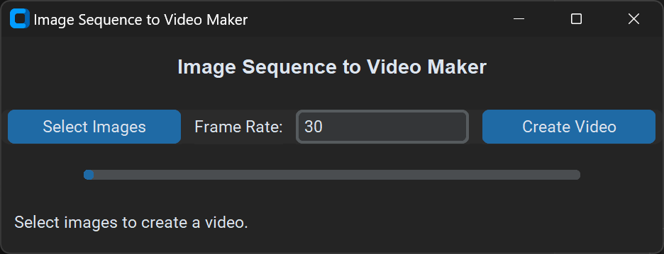

# Images to Video
A small application that turns an image sequence into a video file.

## Usage

1. Click **Select Images** and choose all files in your image sequence. 
2. Change your **frame rate** if neeeded.
3. Click **Create Video**

## Download

Click **releases** to download the latest version. 
